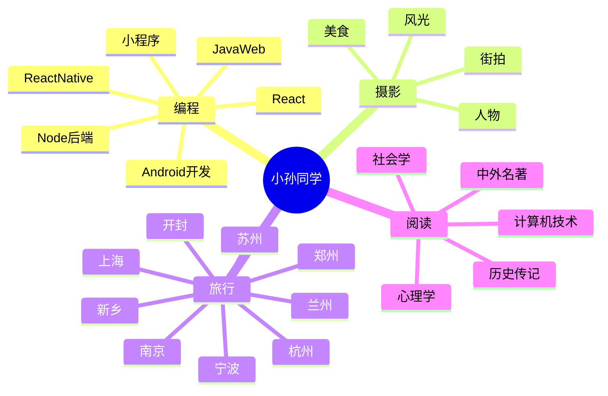

  

    
  

  <!-- profile logo 个人资料徽标 -->
  

    <!-- <-a href="https://twitter.com/azkbo/"-><-img src="https://img.shields.io/badge/Twitter-推特-blue" /-><-/a->&emsp; -->
    
    
    
    
    
    
    
    
    
    
    
    
    <!-- visitor statistics logo 访问量统计徽标 -->
    
  

  <!-- Snake Code Contribution Map 贪吃蛇代码贡献图 -->
  <picture>
    <source media="(prefers-color-scheme: dark)" srcset="https://cdn.jsdelivr.net/gh/azkbo/azkbo/profile-snake-contrib/github-contribution-grid-snake-dark.svg" />
    <source media="(prefers-color-scheme: light)" srcset="https://cdn.jsdelivr.net/gh/azkbo/azkbo/profile-snake-contrib/github-contribution-grid-snake.svg" />
    
  </picture>

<table>

<tr><td>

<!-- About me (关于我) -->
### 🤺 About Me

&emsp;&emsp;一个正在搬砖的程序！

&emsp;&emsp;爱好: 编程、音乐、摄影、美食、读书、旅行。

&emsp;&emsp;愿望: 世界和平？想啥呢赶紧写代码！

</td></tr>

<tr>
<td>

</td></tr>
<tr><td>

<!-- wakatime 统计 -->
### 📊 WakaTime

<picture>
  <source
    srcset="https://github-readme-stats.vercel.app/api/wakatime?username=azkbo&layout=compact&text_color=f0f6fc&bg_color=00000000&hide_border=true&hide_title=true"
    media="(prefers-color-scheme: dark)"
  />
  <source
    srcset="https://github-readme-stats.vercel.app/api/wakatime?username=azkbo&layout=compact&text_color=1f2328&bg_color=00000000&hide_border=true&hide_title=true"
    media="(prefers-color-scheme: light), (prefers-color-scheme: no-preference)"
  />
  
</picture>

</td></tr>

<tr><td>

</table>

<!-- ########################################## 分割 ########################################## -->

<!-- just img 图片 -->

- 🔭 I’m currently working on ...
- 🌱 I’m currently learning ...
- 👯 I’m looking to collaborate on ...
- 🤔 I’m looking for help with ...
- 💬 Ask me about ...
- 📫 How to reach me: ...
- 😄 Pronouns: ...
- ⚡ Fun fact: ...
